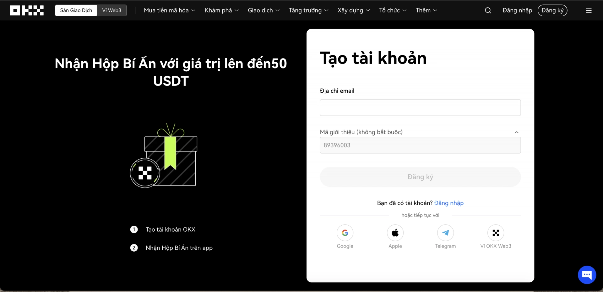
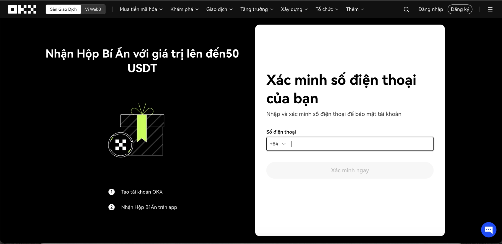
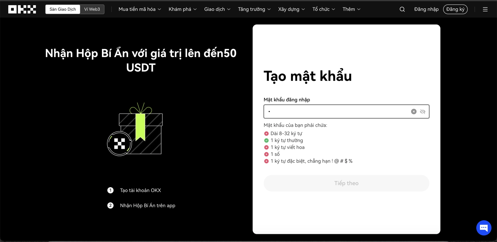
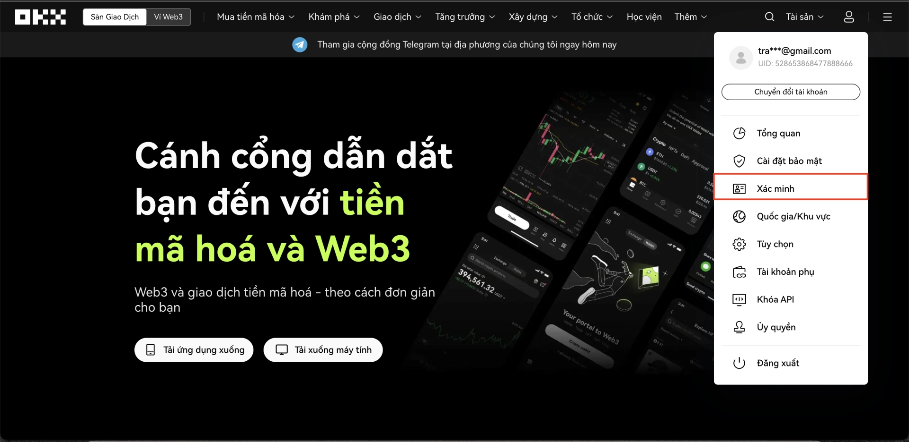
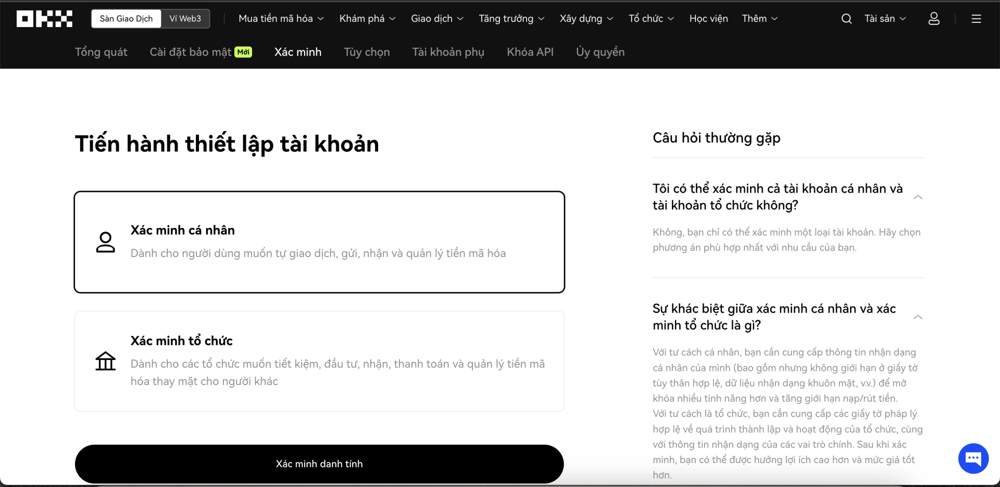
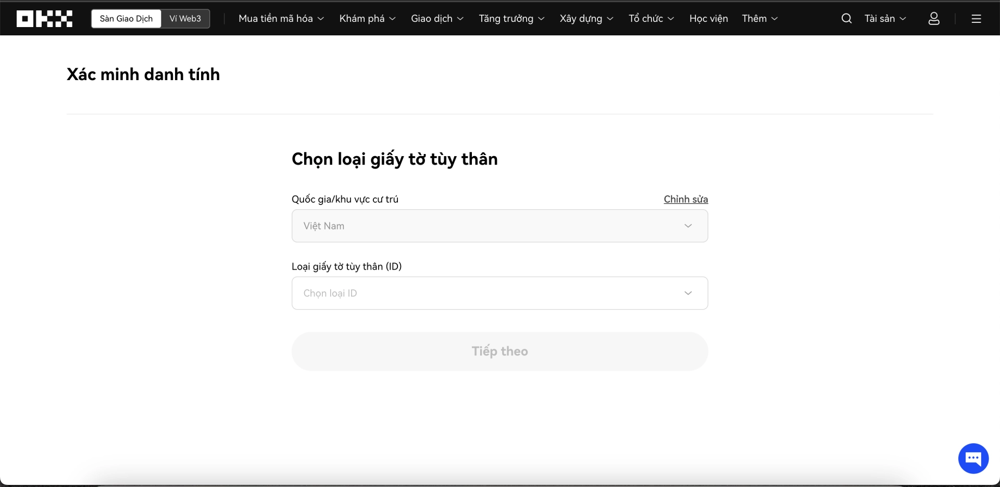

# OKX注册教程：3分钟完成开户与身份认证全流程

---

想在OKX交易加密货币，但不知道从哪开始？这篇教程会带你完成从注册到身份认证的完整流程。整个过程其实挺简单的——准备好邮箱、手机号和身份证件，跟着步骤走就行。不需要复杂的操作，也不用担心看不懂，我们用最直白的方式告诉你每一步该怎么做。

---

## 第一部分：注册OKX账户

**步骤1：邮箱注册**

打开OKX官网，你会看到注册页面。输入你的邮箱地址，点击"注册"按钮。然后检查你的邮箱——OKX会发一个验证码过来，把验证码输入进去就完成第一步了。

**步骤2：绑定手机号**

邮箱验证完，系统会让你输入手机号码。填好号码后，你会收到一条短信验证码，输入验证码继续下一步。

**步骤3：设置密码**

现在该设置密码了。OKX对密码有些要求（长度、字符类型之类的），按照页面提示设置一个你记得住的密码。建议用密码管理器保存，省得以后忘记。

完成这一步，你的账户就创建好了。但先别急着交易——👉 [想要解锁全部功能？点这里完成身份认证，还能享受更高的交易额度](https://www.okx.com/join/62834398)

---

## 第二部分：身份认证流程

注册完账户只是开始。想正常交易、提现，你必须完成身份认证（KYC）。这是所有正规平台的标准要求，也是为了保护你的账户安全。

**步骤1：进入认证页面**

登录后，点击页面右上角的人头图标，在下拉菜单里找到"身份认证"（Verification），点进去。

**步骤2：选择账户类型**

系统会问你是个人用户还是企业用户。大部分人选"个人账户"（Individual account）就行。选好后点"继续"。

**步骤3：上传证件和自拍**

接下来是最重要的一步：

- **选择国家和证件类型**：从列表里选你所在的国家，然后选择证件类型（身份证、驾照或护照都可以）
- **拍摄证件照**：按要求拍摄证件的正反两面，确保照片清晰、四角完整、没有反光
- **自拍验证**：举着证件自拍一张，脸部要清晰可见
- **填写个人信息**：输入姓名、出生日期等基本信息，要和证件上的完全一致

检查一遍所有信息，确认无误后点击"提交"。

提交后通常几分钟到几小时就能审核完成。审核通过后，你就能正常使用OKX的所有功能了——交易、充值、提现都不受限制。

---

## 总结

整个注册和认证过程其实没什么难度：邮箱验证、手机绑定、设置密码，然后上传证件完成身份认证。准备好材料的话，十分钟就能搞定。认证完成后，你就能享受OKX提供的完整交易服务了——👉 [立即注册OKX，使用邀请码62834398开启你的加密货币交易之旅](https://www.okx.com/join/62834398)
